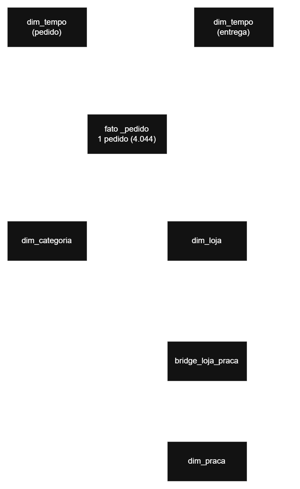

# 🐾 Pata Amiga - Modelo Dimensional

Mini-Projeto Avaliativo - Análise de Dados com Python [T1] - Módulo 2 - Semana 7

## 📋 Contextualização

A Pata Amiga é uma rede catarinense de pet shops com 32 lojas. O projeto constrói um modelo dimensional para responder 5 perguntas de negócio sobre os 4.044 pedidos realizados entre setembro/2023 e março/2024.

## 🏗️ Modelo Dimensional



**Grão da fato:** 1 linha = 1 pedido (4.044 linhas)

- `fato_pedido` (centro) - 4.044 linhas
- `dim_tempo` - 244 linhas (role-playing: pedido e entrega)
- `dim_loja` - 33 linhas
- `dim_categoria` - 38 linhas
- `dim_praca` - 13 linhas
- `bridge_loja_praca` - 48 linhas

## 🔍 Tarefa 1: Diagnóstico da Origem

| Verificação | Quantidade |
|-------------|------------|
| Grafias distintas de loja | 61 |
| Grafias distintas de categoria | 37 |
| Pedidos sem código de loja | 1.575 (39%) |
| Pedidos sem nome de loja | 3 |
| Marcos em branco (separação) | 1.077 |
| Marcos em branco (nota) | 1.338 |
| Marcos em branco (despacho) | 1.665 |
| Marcos em branco (entrega) | 1.953 |

**Problemas encontrados:**
- Todas as colunas vêm como texto
- Dois formatos de data convivem na mesma tabela
- Nomes de loja com acento, sem acento, caixa alta, erros
- Categorias com múltiplas grafias
- "Ração Medicamentosa" não é ração, é medicamento
- Valores em múltiplos formatos
- Cadastro de lojas só tem a foto de HOJE

## 🧹 Tarefa 2: Decisões de Tratamento

### Datas
- **DtHoraPedido:** MM/DD/YYYY HH:MI AM → convertido com MAKE_DATE + SUBSTRING
- **4 marcos da entrega:** YYYY-MM-DD → convertido com ::date

### Valores
- Vazio e "-" → NULL
- Valores com R$ → remove R$, ponto de milhar e troca vírgula por ponto
- **Fallback:** quando o valor líquido é 0, usa o valor bruto (col15 do CSV original)

### Categorias (ordem CRÍTICA)
1. MED → Medicamento
2. PETISC → Petisco
3. RA → Ração
4. HIG → Higiene
5. BRINQ → Brinquedo
6. ACESS → Acessório
7. SERV → Serviço

### Lojas
- `unaccent` + `UPPER` para normalizar
- 3 exceções tratadas no CASE:
  - Blumenal → BLUMENAU
  - Floripa → FLORIANOPOLIS
  - Jgua → JARAGUA

### Canal (ordem CRÍTICA)
1. WHATS → WhatsApp
2. APP → App
3. SITE → Site
4. LOJA → Loja Física
5. TEL → Telefone

### Desconto
- S, SIM, 1, X, TRUE, V → Sim
- N, NAO, 0, FALSE, F → Nao
- Outros → Nao Informado

## 📊 As 5 Respostas

### P1: Onde está o gargalo da entrega?

| Etapa | Tempo Médio (dias) |
|-------|-------------------|
| Integração → Separação | 2,13 |
| Separação → Nota Fiscal | 0,64 |
| **Nota Fiscal → Despacho** | **4,11** ⚠️ |
| Despacho → Entrega | 2,14 |
| **TOTAL** | **9,00** |

**Resposta:** O gargalo **NÃO está na entrega**, e sim entre a **Nota Fiscal e o Despacho** (4,11 dias).

### P2: Qual categoria concentra o faturamento?

| Categoria | Faturamento (R$) | % |
|-----------|-----------------|---|
| **Ração** | **540.623,25** | **67,56%** |
| Medicamento | 145.447,44 | 18,17% |
| Petisco | 57.973,83 | 7,24% |
| Higiene | 39.279,34 | 4,91% |
| Serviço | 7.542,98 | 0,94% |
| Acessório | 6.444,96 | 0,81% |
| Brinquedo | 2.957,19 | 0,37% |

**Resposta:** A categoria **Ração** concentra **67,56%** do faturamento.

### P3: O desconto funciona igual em todo canal?

| Canal | Ticket COM desconto | Ticket SEM desconto |
|-------|---------------------|---------------------|
| App | R$ 488,04 | R$ 170,48 |
| Loja Física | R$ 494,04 | R$ 196,78 |
| Site | R$ 501,92 | R$ 189,48 |
| Telefone | R$ 514,02 | R$ 195,46 |
| WhatsApp | R$ 514,33 | R$ 173,88 |

**Resposta:** O desconto **NÃO derruba o ticket** — pelo contrário, pedidos COM desconto têm ticket **maior** em todos os canais.

### P4: Qual praça concentra o faturamento?

| Praça (Regional) | Faturamento Rateado (R$) | % |
|------------------|-------------------------|---|
| **Vale do Itajaí** | **633.746,09** | **35,34%** |
| Grande Florianópolis | 283.546,75 | 15,81% |
| Norte Industrial | 175.431,90 | 9,78% |
| Litoral Sul | 137.051,20 | 7,64% |
| Litoral Norte | 128.872,75 | 7,19% |

**Resposta:** A praça **Vale do Itajaí** concentra **35,34%** do faturamento (com rateio pelo fator de público).

### P5: Onde abrir a próxima loja?

**a) Ranking por itens/1000 habitantes:**

| # | Loja | Itens/1000 hab | Tempo Médio |
|---|------|----------------|-------------|
| 1 | Rio dos Cedros | 23,58 | 14,24 dias |
| 2 | Ibirama | 17,84 | 15,39 dias |
| 3 | Presidente Getúlio | 14,98 | 14,16 dias |

**b) Faturamento por faixa ATUAL:**

| Faixa | Lojas | Faturamento (R$) | % |
|-------|-------|-----------------|---|
| Ouro | 15 | 1.011.264,38 | 56,39% |
| Diamante | 5 | 382.209,74 | 21,31% |
| Prata | 8 | 314.812,03 | 17,55% |
| Bronze | 4 | 84.036,06 | 4,69% |

**c) O que ficou de fora:**

| Métrica | Valor |
|---------|-------|
| Pedidos sem loja | 3 |
| Entregas não concluídas | 1.953 |
| Itens em branco | 257 |
| Valores em branco | 121 |

## 🎯 Recomendação Final

**Abrir a próxima loja em uma cidade de PORTE MÉDIO**, como:
- **Gaspar** (8,35 itens/1000 hab, entrega 8,01 dias)
- **Timbó** (8,00 itens/1000 hab, entrega 7,70 dias)

**O que os dados NÃO permitem afirmar:**
- Qual era a faixa de franquia das lojas na data do pedido (passado sobrescrito)
- O impacto real do desconto no ticket
- O comportamento de 1.953 clientes que ainda não receberam

## 🚀 Como Reproduzir

Execute os scripts na ordem: 01, 02, 03, 04, 05, 06, 07.

## 📁 Estrutura do Repositório

```text
MiniProjeto_PataAmiga/
├── README.md
├── diagrama.png
└── sql/
    ├── 01-carga-staging.sql
    ├── 02-dimensoes-prontas.sql
    ├── 03-dim_categoria.sql
    ├── 04-dim_praca_bridge.sql
    ├── 05-fato_pedido.sql
    ├── 06-conferencia.sql
    └── 07-perguntas_negocio.sql
```
